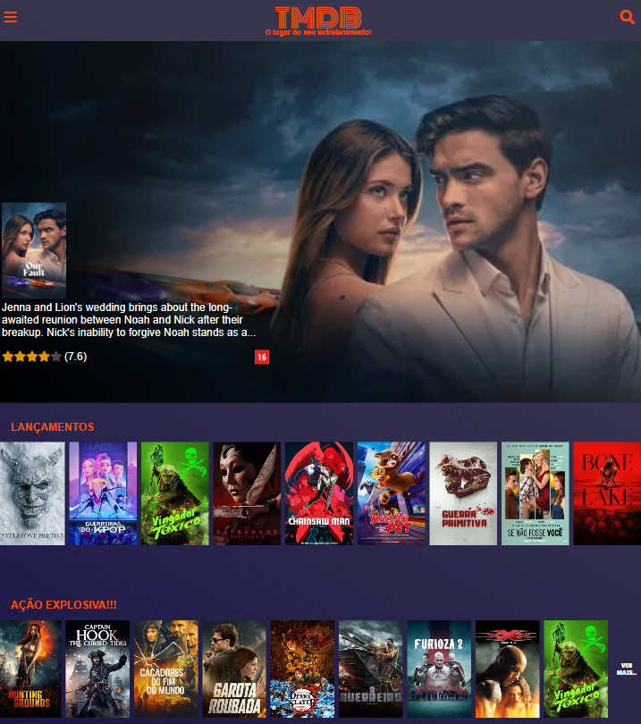
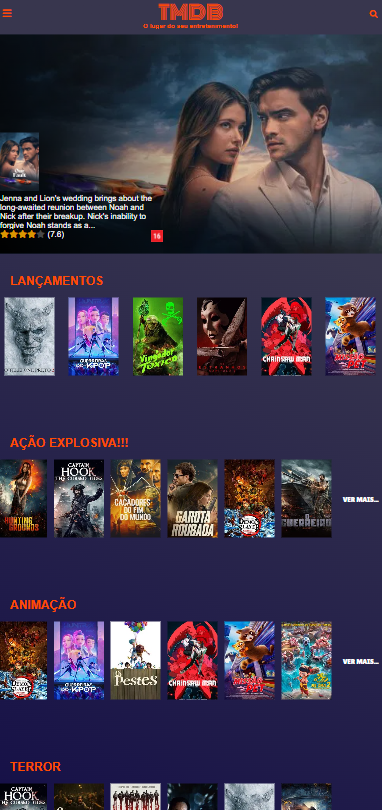
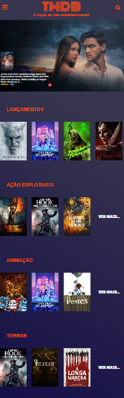

### Site de Filmes | TMDB 🍿🎬

## Preview do projeto





---

Bem-vindo aao projeto do seu maior entretenimento, o **TMDB**, um site de filmes simples integrado com a API . O objetivo deste projeto foi testar minhas minhas habilidades com HTML, CSS, JavaScript, Lógica de programação, consumo de API's com fetch, e tratativa/manipulação de dados de retorno da API

O site apresenta navegação:

página home
página de filmes de acordo com a categoria
página do filme selecionado

---

## Stacks utilizadas 👩🏻‍💻

* **HTML:** Para o esqueleto/estrutura das páginas.
* **CSS:** Para estilização das páginas.
* **JavaScript:** Para adicionar funcionalidades à página.
* **Lógica:** Capacidade de racíocinio lógico para resolução de problemas no meio do desenvolvimento do projeto.

---

## Como rodar localmente?

1. **Faça um fork do projeto**

    Já no repositório desejado, clique no botão do canto superior direito escrito fork, escolha o nome do repositório desejado.

2. **git clone**

    Após o fork, vá até o repositório que você criou, copie a url do repositório, e execute o seguinte comando no prompt:

    ```bash
        git clone [URL DO REPOSITÓRIO]
    ```

3. **Visual Studio Code**

    Abra o Visual Studio Code, instale a extensão live server, abra a pasta dentro do Visual Studio Code, clique no arquivo index.html e no botão inferior direito "Go Live".

---

## Autor

Esse projeto foi criado por **Gabriel Lacerda**

* **LinkedIn:** [linkedin.com/in/gabriellacerda1005](https://www.linkedin.com/in/gabriellacerda1005)